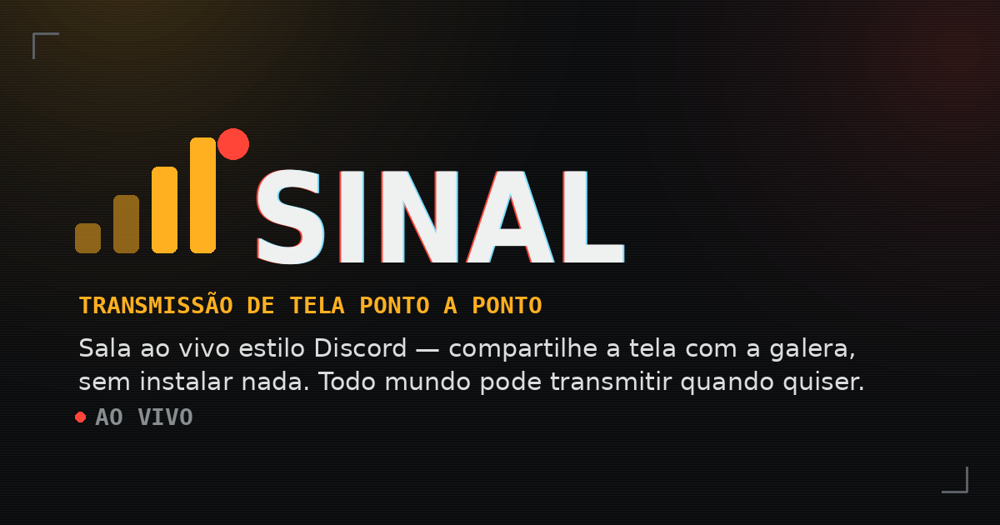
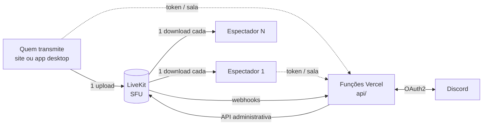

<div align="center">

# Sinal

**Transmissão de tela ao vivo para o seu grupo de amigos.**
Entre numa sala, compartilhe a tela e todo mundo assiste junto, enquanto a conversa segue na call de voz.

[**Abrir o Sinal**](https://sinal-app-stream.vercel.app) · [Baixar o app para Windows](https://github.com/Pedr030/sinal-app/releases/latest) · [Novidades](public/changelog.json)

[](https://github.com/Pedr030/sinal-app/actions/workflows/tests.yml)
[](LICENSE)

-1E1E2E.svg)



</div>

---

## Sumário

- [Por que existe](#por-que-existe)
- [Funcionalidades](#funcionalidades)
- [Arquitetura](#arquitetura)
- [Segurança e privacidade](#segurança-e-privacidade)
- [Stack](#stack)
- [Estrutura do repositório](#estrutura-do-repositório)
- [Rodando localmente](#rodando-localmente)
- [App desktop](#app-desktop)
- [Testes e CI](#testes-e-ci)
- [Operação](#operação)
- [Documentação adicional](#documentação-adicional)
- [Licença](#licença)

## Por que existe

Em agosto de 2026, a ANPD determinou a suspensão do compartilhamento de tela e vídeo do Discord no Brasil. Voz e texto continuaram funcionando, e um grupo de amigos que se reunia justamente para assistir jogo e vídeo junto ficou sem esse recurso.

O Sinal nasceu para cobrir só essa parte. Ele roda **em paralelo** com a call de voz, que continua no Discord: o Sinal cuida apenas da imagem. É pequeno de propósito, feito para um grupo conhecido, sem pretensão de virar um clone do Discord.

## Funcionalidades

### Salas e transmissão

- **Entrada por código ou link**: salas de 6 caracteres, sem cadastro. Quem tem o código entra.
- **Várias transmissões ao mesmo tempo**, com tela em destaque, fileira de miniaturas e até 2 telas fixadas lado a lado. Também há câmera.
- **Qualidade ajustável por transmissão**:

  | Preset | Resolução | Quando usar |
  |---|---|---|
  | Leve | 720p · 30 fps | upload fraco |
  | Nítido | 1080p · 30 fps | texto e vídeo |
  | Fluido | 1080p · 60 fps | jogos |

- **Codecs escolhidos conforme o aparelho**: H.265 por placa de vídeo quando existe (Leve e Nítido), H.264 por placa no Fluido, com VP8 como reserva automática para quem assiste sem H.265.
- **Chat de texto** sem histórico: a conversa some ao sair da sala, por design.
- **Indicador de qualidade da conexão** em tempo real (nível do LiveKit, perda de pacotes e jitter).
- **Painel de participantes** com avatar, nome e quem está transmitindo.

### Servidores do Discord

- **Login com Discord** (OAuth2, escopo `identify guilds`): traz nome e avatar e mostra os servidores em que a pessoa está.
- **Salas por servidor**, até 10 por servidor e 25 pessoas por sala. A lista de transmissões ao vivo dos seus servidores aparece na tela inicial.
- **Presença**: o Sinal avisa quando alguém do seu servidor começa a transmitir, por webhooks do LiveKit.
- **Salas privadas** com três modos de acesso:
  - **Aberta**: qualquer pessoa do servidor entra.
  - **Com aprovação**: quem pede para entrar espera a decisão de quem já está na sala.
  - **Com senha**: a senha é guardada **apenas cifrada** (AES-256-GCM), sem hash armazenado, e há limite de tentativas por pessoa.
- **Gerenciar sala**: renomear, trocar a senha, trocar o tipo de acesso, passar a sala para outra pessoa ou encerrá-la. Quem pediu para entrar e ainda não foi respondido acompanha a mudança de tipo (sala que virou aberta deixa entrar sozinho).
- **Moderação hierárquica**: dono do servidor, administradores e quem tem permissão de gerência podem expulsar alguém ou desligar a tela/câmera remotamente (a captura é encerrada de verdade do lado de quem foi mutado).

### App desktop (Windows)

- **Áudio isolado por processo**: transmite o som só do jogo ou do programa compartilhado, sem vazar o resto do sistema (addon nativo em Rust).
- **Atalho global** (padrão `Ctrl+Alt+S`) para começar e parar de transmitir sem sair do jogo.
- **Bandeja do sistema**, iniciar com o Windows e iniciar minimizado.
- **Atualização automática** com janela própria.
- **Links `sinal://`** para abrir a sala direto no app.
- **Retomar transmissão** depois de uma queda do app, sempre com confirmação.
- **Picture-in-Picture** que devolve o foco ao app ao expandir.
- **Codificação pela placa de vídeo (experimental)**: opção que usa o chip de vídeo da placa para comprimir a transmissão e poupar o processador durante o jogo. Fica desligada por padrão e cinza, com aviso, quando a placa não suporta.
- **Enviar relatório** de problemas, com diagnóstico de captura e codificação, para o canal privado do dono.

## Arquitetura

O projeto começou com WebRTC ponto a ponto, em que quem transmite recodifica o vídeo uma vez por espectador, e o processador de quem joga não aguentava mais de 2 ou 3 pessoas assistindo. Hoje o Sinal usa um **SFU** ([LiveKit](https://livekit.io/) self-hosted): quem transmite envia **uma** cópia e o servidor repassa para todos, sem recodificar.



**Sem banco de dados.** O estado durável de uma sala (tipo de acesso, aprovados, recusados, criador, título e senha cifrada) fica no **metadata da própria sala no LiveKit**, e a sessão de login é um token assinado guardado no navegador. As funções serverless não guardam nada entre chamadas:

| Função | Papel |
|---|---|
| `api/get-token.js` | Autoriza a entrada: valida sessão, regras de acesso e limites, e emite o token do LiveKit |
| `api/room-admin.js` | Aprovar/recusar pedidos, revelar a senha e gerenciar a sala (renomear, senha, acesso, passar, encerrar) |
| `api/moderate.js` | Expulsar e desligar tela ou câmera de alguém |
| `api/discord-login.js`, `api/discord-callback.js` | Fluxo OAuth2 com o Discord |
| `api/lives.js` | Lista as salas ao vivo dos servidores de quem pergunta |
| `api/lk-webhook.js` | Recebe os webhooks do LiveKit e dispara a presença |
| `api/report.js` | Recebe o "Enviar relatório" do app e repassa a um webhook privado |

A lógica compartilhada fica em `lib/` (`rooms.js`, `session.js`, `lives.js`, `ratelimit.js`). O frontend (`public/`) é HTML, CSS e JS puro, sem framework e sem etapa de build.

## Segurança e privacidade

O repositório é público, então a segurança não depende de segredo no código. Em resumo:

- **Nenhuma senha de usuário passa pelo Sinal.** O login é OAuth2 padrão: a senha é digitada no site do Discord.
- **Segredos só no servidor**, em variáveis de ambiente das funções. O diretório publicado (`public/`) é fisicamente separado da raiz onde o `.env` local vive.
- **Sessões e tokens assinados**; toda ação de gerência e moderação é revalidada no servidor a cada chamada, sem confiar no que o cliente diz.
- **Senhas de sala só cifradas**, com chave derivada do segredo do servidor e o nome da sala como dado autenticado. Tentativas erradas têm limite por pessoa e por sala.
- **Limites de uso** (rate limit) nos endpoints sensíveis.
- **Content-Security-Policy** estrita, sem `unsafe-inline`, mais `X-Frame-Options`, `Referrer-Policy` e `nosniff`. O `livekit-client` é carregado com versão exata e verificação SRI.
- **Entrada do usuário nunca vira HTML**: nomes e avatares são montados via DOM, e o avatar só é aceito se vier do CDN do Discord.
- **Sem histórico**: o chat não é persistido e o servidor não guarda contas nem mídia.

Encontrou uma vulnerabilidade? Veja [SECURITY.md](SECURITY.md) e use a denúncia privada do GitHub.

## Stack

| Camada | Tecnologia |
|---|---|
| Frontend | HTML, CSS e JavaScript puros, PWA (Service Worker + Web App Manifest) |
| Mídia | [LiveKit](https://livekit.io/) self-hosted (SFU) e [livekit-client](https://github.com/livekit/client-sdk-js) |
| Backend | [Vercel Functions](https://vercel.com/docs/functions) (Node) com [livekit-server-sdk](https://github.com/livekit/node-sdks) |
| Login | Discord OAuth2 |
| App desktop | [Electron](https://www.electronjs.org/), electron-builder, electron-updater e addon nativo em Rust |
| Testes | `node --test` (sem dependências extras) |
| Hospedagem | Vercel (site) e uma VM própria (servidor LiveKit) |

## Estrutura do repositório

```
sinal-app/
├── public/                  # tudo que é servido publicamente
│   ├── index.html, style.css
│   ├── app.js                # lógica do cliente
│   ├── sw.js, manifest.json  # PWA e versionamento do cache
│   ├── changelog.json        # "Novidades" mostradas no site
│   └── login-app.*           # retorno do login para o app desktop
├── api/                     # funções serverless (Vercel), ver tabela acima
├── lib/                     # regras de salas, sessão, lista ao vivo, rate limit
├── tests/                   # testes automatizados (node --test)
├── electron/                # app desktop
│   ├── src/                  # processo principal, preload e janelas
│   └── native/               # addon de áudio isolado por processo (Rust)
├── tools/vm-dashboard/      # painel local de consumo da VM (não vai para a Vercel)
├── .github/workflows/       # CI
├── vercel.json              # cabeçalhos de segurança e diretório publicado
├── HANDOFF.md               # histórico de decisões e guia de manutenção
└── SECURITY.md
```

## Rodando localmente

Requisitos: Node 24 e um servidor LiveKit (o [LiveKit Cloud](https://cloud.livekit.io) tem plano gratuito, ou use um self-hosted seguindo a [documentação oficial](https://docs.livekit.io/home/self-hosting/)).

```bash
npm install
```

Crie um `.env` na raiz (ele está no `.gitignore`):

```bash
# Obrigatórias
LIVEKIT_URL=wss://seu-servidor-livekit.exemplo.com
LIVEKIT_API_KEY=...
LIVEKIT_API_SECRET=...

# Login com Discord e salas por servidor
# (crie a aplicação em https://discord.com/developers/applications
#  e registre <sua-url>/api/discord-callback como redirect)
DISCORD_CLIENT_ID=...
DISCORD_CLIENT_SECRET=...

# Opcionais
ADMIN_DISCORD_IDS=123456789012345678,...   # IDs com poder de moderação em qualquer sala
DISCORD_REPORT_WEBHOOK_URL=https://discord.com/api/webhooks/...   # destino do "Enviar relatório"
```

Depois suba o site e as funções juntos:

```bash
npx vercel dev
```

Para a presença em tempo real, configure no seu servidor LiveKit um webhook apontando para `<sua-url>/api/lk-webhook`.

## App desktop

O app é o mesmo site dentro do Electron, com os recursos nativos listados acima. Os instaladores ficam em [Releases](https://github.com/Pedr030/sinal-app/releases) (tags `desktop-vX.Y.Z`) e o app instalado se atualiza sozinho.

> O instalador não é assinado com certificado pago, então o SmartScreen do Windows pode mostrar "Editor desconhecido". Clique em **Mais informações → Executar assim mesmo**. O código é todo público neste repositório.

Para rodar a partir do código:

```bash
cd electron
npm install
npm start
```

Por padrão o app abre o site publicado. Para apontar para o seu ambiente local, defina `SINAL_DEV_URL` (por exemplo `http://localhost:3000`) antes de iniciar.

Para gerar o instalador (`electron/dist/`), é preciso o toolchain Rust e as Build Tools do Visual Studio, por causa do addon de áudio:

```bash
cd electron
npm run dist
```

## Testes e CI

```bash
npm test
```

Roda a suíte completa com o test runner nativo do Node, cobrindo emissão de token, regras de acesso e aprovação, senha de sala, moderação, OAuth, webhooks, rate limit, service worker, changelog e lógica pura do cliente. O GitHub Actions executa `npm ci` e `npm test` em todo PR e a cada push para `main` e `development`, e o CodeQL analisa o código.

## Operação

- **Fluxo de branches**: o trabalho acontece em `development`; PR para `main`, que só entra com o CI verde. A Vercel publica o site a partir de `main`.
- **Versões**: o site tem versão própria (`APP_VERSION` em `public/app.js`, junto de `CACHE` em `public/sw.js`) e o app desktop tem a dele (`electron/package.json`).
- **Servidor de mídia**: o LiveKit roda numa VM própria. O painel local `npm run vm` mostra CPU, memória, rede e contagem de salas e pessoas (nunca nomes), por SSH; veja [tools/vm-dashboard](tools/vm-dashboard/README.md).

## Documentação adicional

- [HANDOFF.md](HANDOFF.md): decisões de projeto, problemas já resolvidos, testes de carga, o que foi tentado e descartado, e o passo a passo de publicação. É o ponto de partida para quem for dar manutenção.
- [SECURITY.md](SECURITY.md): como reportar vulnerabilidades.
- [Novidades](public/changelog.json): histórico de mudanças voltadas aos usuários.

## Licença

[MIT](LICENSE) © 2026 Pedro Henrique Fernandes
